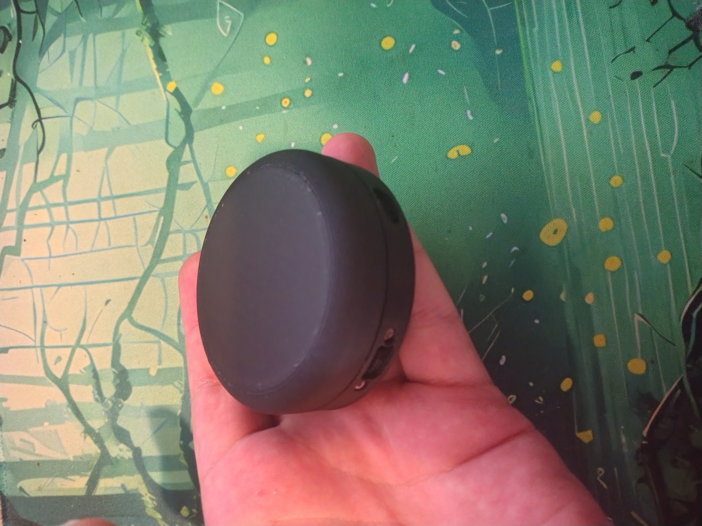

# Media Knob
A little HID device to control media and scrolling.

Tested on linux, macos and windows

## Build Guide
[Build Guide found heer](build-guide.md)

## Controls
### Scroll mode
- spin for high resolution scrolling
- press and spin to zoom

### Media Mode
- spin to change volume
- double tap to play/pause
- press and spin to skip to next/prev track

## Roadmap
### Software
- [x] scroll mode
    - [x] high res scrolling
    - [x] zoom
- [x] media media
    - [x] play/pause
    - [x] volume
    - [x] next/prev
- [x] mode switching (scroll/media)
- [ ] bluetooth
    - [x] Connect via bluetooth
    - [ ] low power mode
        - in progress
    - [x] properly report battery life
- [ ] usb
    - [x] get usb working alone
    - [ ] get usb working along side bluetooth

### Hardware
- [x] connect as5600 sensor
- [x] trigger a button when you press on the dial
- [x] mode switching button
- [x] sort out battery

### Cad
- [x] dial
- [x] bottom cover
- [x] main body (needs updating for buttons)

### Other
- [ ] create documentation
- [ ] upload final cad files

## Possible tasks
It might be nice to have a macro mode that lets you configure what the dial does in an application
running on the host device.

## Wiring
### as5600
- scl -> 011 - yellow
- sda -> 100 - green

### input
- mode -> 111 - blue
- mod  -> 010 - white
