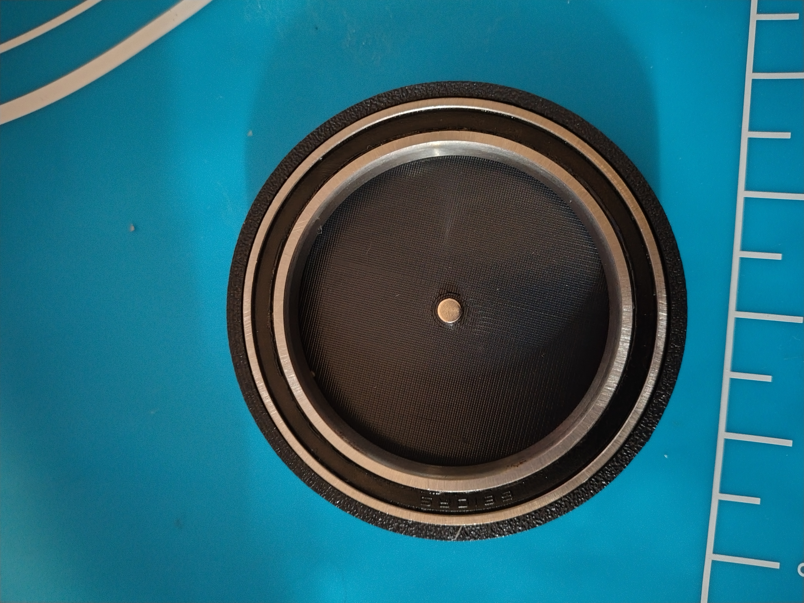
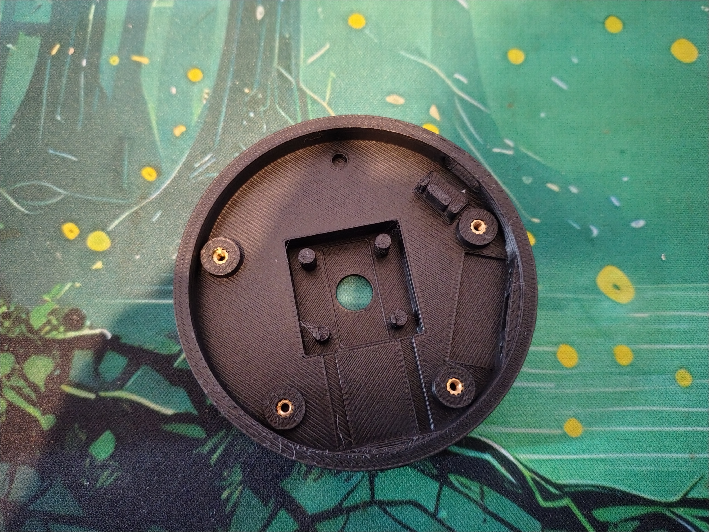
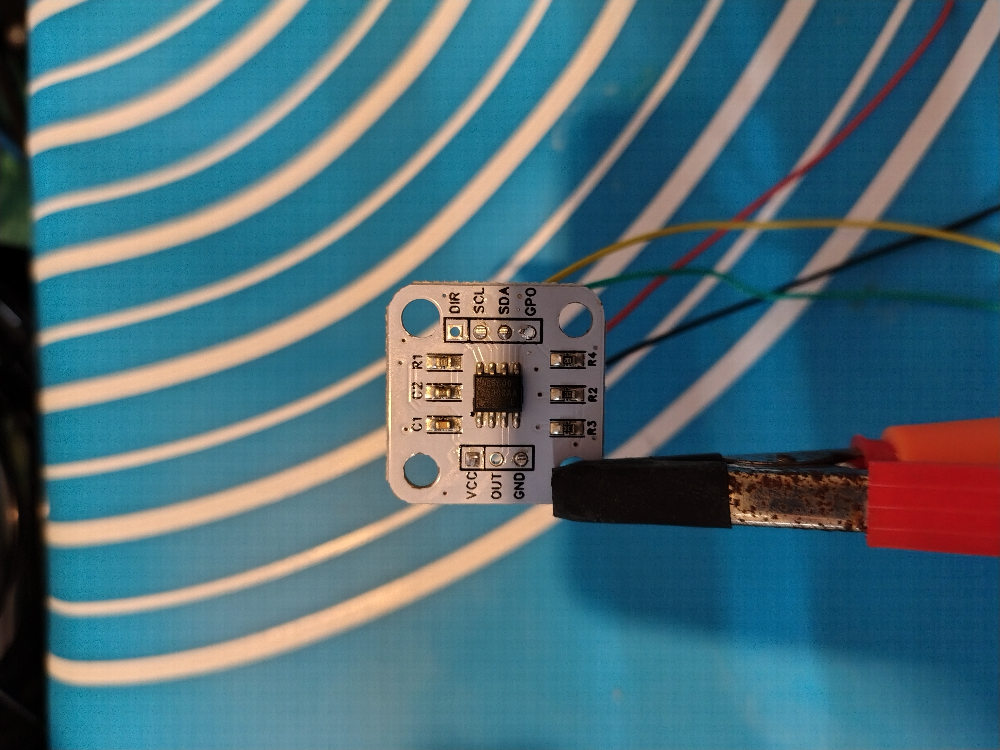
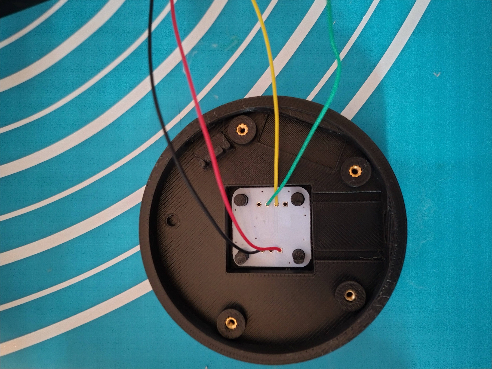
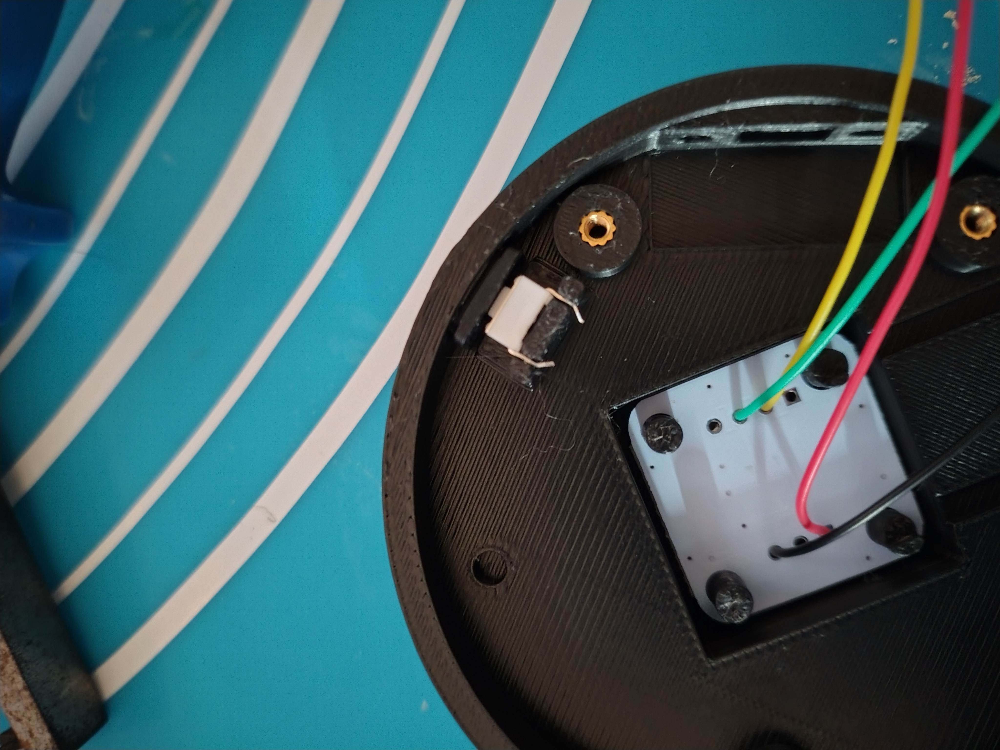
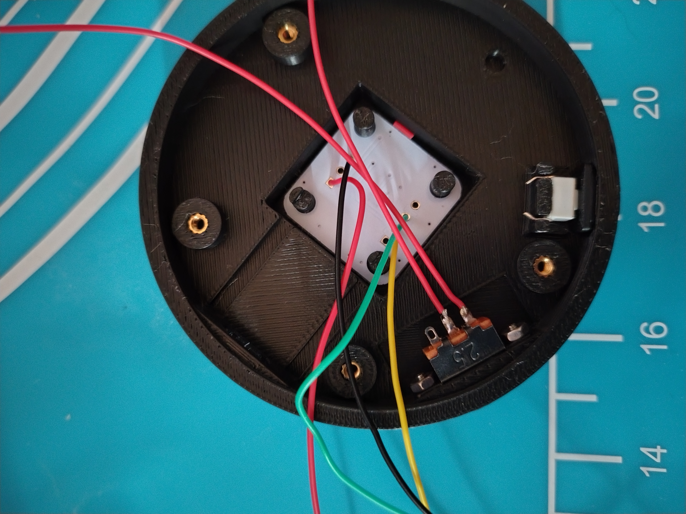
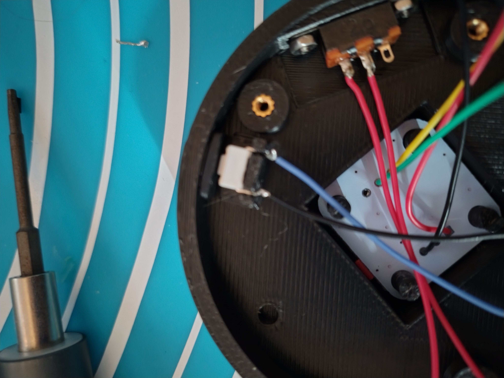
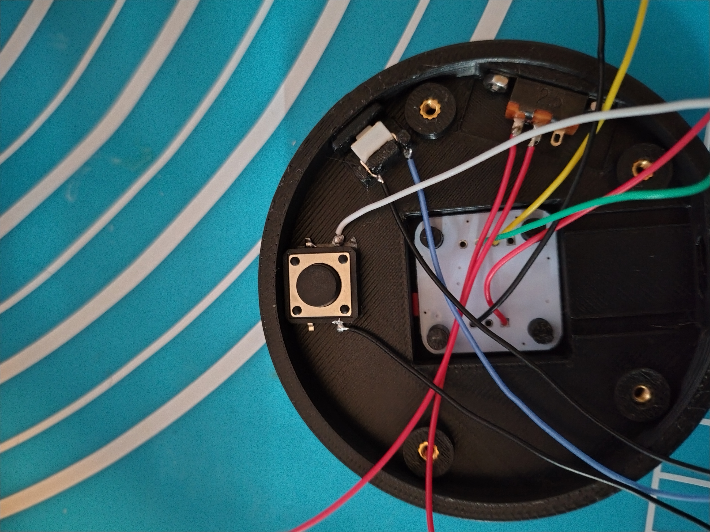
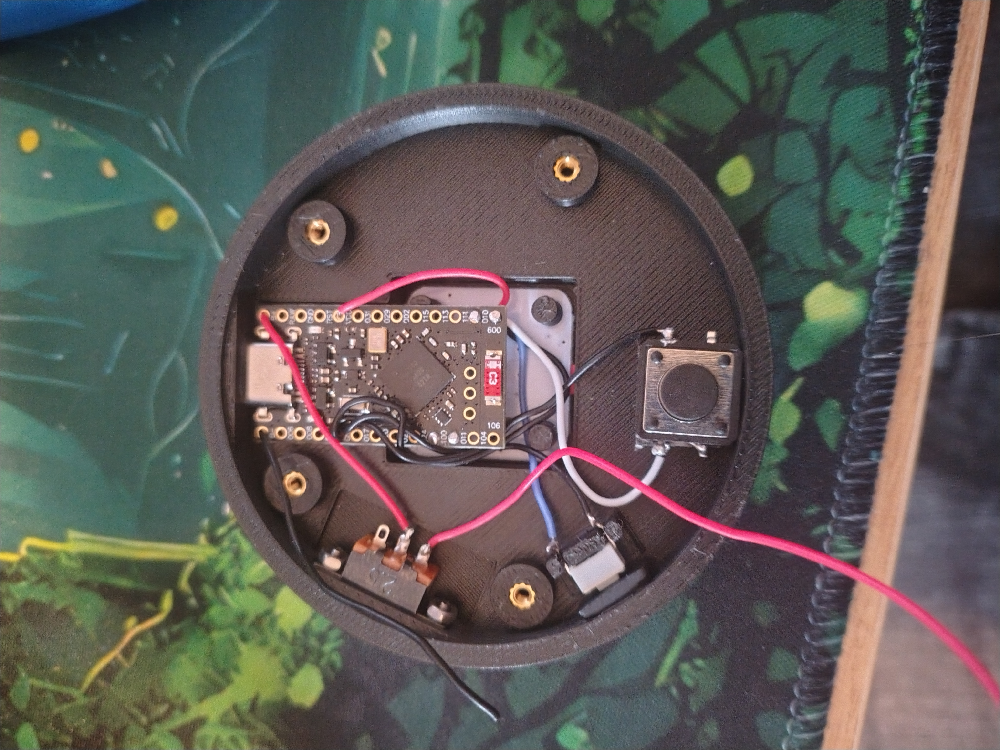

## Parts list
### Electrical
- 1x [Pro micro nrf52840 micro controller](https://www.aliexpress.com/w/wholesale-Nrf52840-Pro-Micro.html?spm=a2g0o.detail.search.0)
- 1x [as5600 magnetic encoder (white dev board)](https://www.aliexpress.com/w/wholesale-as5600.html?spm=a2g0o.productlist.search.0)
- 1x [301230 lipo battery](https://www.aliexpress.com/w/wholesale-301230.html?spm=a2g0o.productlist.search.0)
- 1x 6x6x4.3 push button
- 1x 12x12x5 patch push button
- 1x SS12D10 2 position toggle switch

### Hardware
- 4x m2x4x3.2 heat set inserts
- 6x m2x4 bolts
- 2x m2 nuts

### Printed Parts
- 1x [Dial Base](cad/base.stl)
- 1x [Base Cover](cad/bottom-cover.stl)
- 1x [Dial Top](cad/dial.stl)
- 1x [Mode Switch Button](cad/mode-button.stl)

### Other
- 1x [65mm od x 50mm x 7mm bearing ](https://www.aliexpress.com/item/1005011831553272.html?spm=a2g0o.productlist.main.1.6f92255bhzqNoO&algo_pvid=ff2ef7f1-0f06-4027-84b1-864b2f97e7c8&algo_exp_id=ff2ef7f1-0f06-4027-84b1-864b2f97e7c8-0&pdp_ext_f={%22order%22%3A%2214%22%2C%22eval%22%3A%221%22%2C%22fromPage%22%3A%22search%22}&pdp_npi=6%40dis!GBP!13.41!6.71!!!118.46!59.23!%40211b655217808439447296990e0848!12000056729960207!sea!UK!2482384161!X!1!0!n_tag%3A-29919%3Bd%3Acda67a48%3Bm03_new_user%3A-29895&curPageLogUid=0vgzU3UKqwhK&utparam-url=scene%3Asearch|query_from%3A|x_object_id%3A1005011831553272|_p_origin_prod%3A)
- 5x rubber feet (whatever size you want)
- thing gage wire
- heat shrink (optional but recommended)
- double sided tape

### Tools
- Soldering Iron
- driver for m2 bolts
- wire cutters
- wire strippers
- 3d printer

## Build instructions
1) Insert the bearing into the dial top. This should fit snugly without any need for adhesive.
2) Insert the magnet provided with your as5600 into the center cavity of the dial top. This should fit snugly but a little adhesive is probably a good idea.

3) Use a soldering iron to insert the m2 heated inserts into their holes

4) solder wires to the GND, VCC, SCL and SDA pins of the as5600 with the wires trailing out through the back

5) Insert the as5600 into its recess. All of my boards have the sensor slightly offset and the print has been adjusted to account for this, you need the 4 hole side aligned with the power switch cutout to properly align the sensor.

6) Insert the Mode switch button into its cutout and secure with the 6x6x4.3 push button.

7) Solder 2 wires to the power button then screw it into place. You can solder the wires after insertion but doing them first is much simpler

8) Solder a data and ground wire to the mode switch button

9) Solder a ground and data wire to the 12x12x5 push button and use a small amount of double sided tape to secure it in place.  
    __Note: here that in the image I have soldered the wires in the wrong location, they should be diagonal from each other.__

10) Cut all your wires to a more reasonable length and solder everything to the micro controller.

| component | wire | pin |
| --- | --- | --- |
| as5600 | GND (black) | GND |
| as5600 | VCC (red) | VCC |
| as5600 | SCL (yellow) | 011 |
| as5600 | SDA (green) | 100 |
| Mode Sw | black | GND |
| Mode Sw | blue | 111 |
| Mod Sw | black | GND |
| Mod Sw | white | 010 |
| Power Sw | red | B+ |
| N/A | black | B- |

11) Stick the micro controller in place with some double sided tape.  
    __Note: the cheap controllers don't all have the usb port at the same height relative to the board. I have setup the model to account for the most offset board i have and so you may need to pad the bottom of the board to make it line up propperly__

12) Wire up the battery to the remaining power switch wire and black wire coming out of B-. I recommend using either some heat shrink if you have it or electrical tape to wrap the wires and prevent shorts.
13) Stick the battery in place with some double sided tape.

14) push the dial top into place over its peg. This should fit snugly with no need  for adhesive.

15) flash the controller:
    - Connect the pro micro to a computer via usb
    - quickly short the rst pin to gnd twice
    - the red light should slowly pulse and an external storage device will show up on your computer
    - copy the latest uf2 file from the releases page to your controller.
    - once coppied the device will automatically eject from your computer and restart.

16) screw the base plate into place.  
    Don't put too much screw pressure on the two bolts either side of the mod button or it will stay permanently pressed.

17) turn on the power switch and connect the device to start using it.

## Note on charging
To actually charge the device the power switch needs to be in the on position or there will be no connection to the battery.
